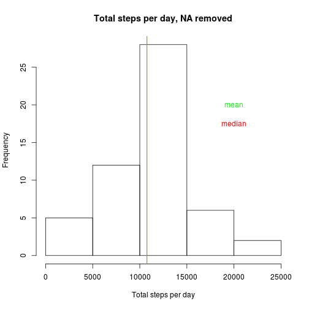
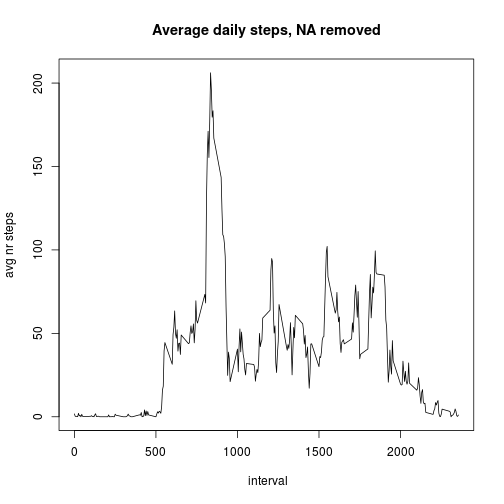

## Introduction

This report describes the steps needed to analyze the data of one person:  
number of steps in 5-minutes intervals during 2 months in 2012.  
For a more detailed overview see the Readme.md-file in the repo. 
The data came with the repo, so is in the working directory  
The data can be downloaded from: https://d396qusza40orc.cloudfront.net/repdata%2Fdata%2Factivity.zip

## Loading and preprocessing the data


```r
# when data is not dowloaded or unzipped yet:
if(!file.exists("activity.zip")){
        require(downloader)
        require(curl)
        url="https://d396qusza40orc.cloudfront.net/repdata%2Fdata%2Factivity.zip"
                download.file(url,"activity.zip", method="curl")
}
if (!file.exists("activity.csv")){
        unzip("activity.zip")
}
data<-read.csv("activity.csv",sep=",")
require(lubridate)
data$date<-ymd(data$date)
nrIntervals<-24*60/5 
options(scipen=0)
options(digits=5) # seems not to be working
```

## What is mean total number of steps taken per day?


```r
require(data.table)
##totalStepsPerDay<-data[,sum(steps),by=date]
##POSIXct should be supported by data.table (POSIXlt is not), but I do not get 
## a result: unused agument by=date, so I used the slower tapply
totalStepsPerDay<-tapply(data$steps,data$date,sum,na.rm=TRUE)
summary(totalStepsPerDay)
```

```
##    Min. 1st Qu.  Median    Mean 3rd Qu.    Max. 
##       0    6780   10400    9350   12800   21200
```

```r
meanStepsPerDay=floor(mean(totalStepsPerDay))
medianStepsPerDay=floor(median(totalStepsPerDay))
hist(totalStepsPerDay)
abline(v=medianStepsPerDay,col="red")
abline(v=meanStepsPerDay, col="green")
text(x=20000,y=20,labels="mean", col="green")
text(x=20000, y=17.5, labels="median", col="red")
```

 
  
 
The mean number of steps taken per day is 9354.  
The median number of steps taken per day is 1.0395 &times; 10<sup>4</sup>.  


## What is the average daily activity pattern?

```r
averageDailyActivity<-tapply(data$steps,data$interval,mean,na.rm=TRUE)
index1<-which(averageDailyActivity==max(averageDailyActivity))
plot(averageDailyActivity~data$interval[1:nrIntervals], type="l", xlab=" interval", ylab="avg nr Steps")
```

 
  

The 5-minute interval on average across all days in the data set that contains the maximum number of steps taken is 104 of 288, or shown in the graph as number 835.


## Imputing missing values
For determining a strategy for imputing missing variables, it is important to know when these occur.


```r
summary(data$steps) #report the number of NA in steps
```

```
##    Min. 1st Qu.  Median    Mean 3rd Qu.    Max.    NA's 
##     0.0     0.0     0.0    37.4    12.0   806.0    2304
```

```r
summary(data$date) # report the number of NA in date
```

```
##         Min.      1st Qu.       Median         Mean      3rd Qu. 
## "2012-10-01" "2012-10-16" "2012-10-31" "2012-10-31" "2012-11-15" 
##         Max. 
## "2012-11-30"
```

```r
summary(data$interval) # report the number of NA in interval
```

```
##    Min. 1st Qu.  Median    Mean 3rd Qu.    Max. 
##       0     589    1180    1180    1770    2360
```

```r
#find the missing values
index_NA<-is.na(data$steps)
total_NA<-sum(index_NA)
daysNoActivity<-sum(totalStepsPerDay==0)
intervalsNoActivity<-daysNoActivity*nrIntervals
```
So the number of days with missing data is 8,the total number of NA is 2304, which is 8*24*60/5.
It turns out that the missing values are caused by the fact that no data was recorded during 8 days. Taking the average steps per day as an input would give a big shift in the intervals, therefore the missing value is replaced by the average of the interval.
The new data set will be created in the chunk below.


```r
dataNoNA<-data
index2 <-floor(averageDailyActivity[sapply(dataNoNA$interval[index_NA],toString)])
dataNoNA$steps[index_NA]<-index2
```

The influence of filling is shown in the following histogram

```r
summary(totalStepsPerDayNoNA)
```

```
##    Min. 1st Qu.  Median    Mean 3rd Qu.    Max. 
##      41    9820   10600   10700   12800   21200
```

```r
meanStepsPerDayNoNA=floor(mean(totalStepsPerDayNoNA))
medianStepsPerDayNoNA=floor(median(totalStepsPerDayNoNA))
totalStepsPerDayNoNA<-tapply(dataNoNA$steps,dataNoNA$date,sum,na.rm=TRUE)
hist(totalStepsPerDayNoNA)
abline(v=medianStepsPerDayNoNA,col="red")
abline(v=meanStepsPerDayNoNA, col="green")
text(x=20000,y=20,labels="mean", col="green")
text(x=20000, y=17.5, labels="median", col="red")
```

 
  
  
The mean of the total number of steps taken per day is now 1.0749 &times; 10<sup>4</sup>, while the median is 1.0641 &times; 10<sup>4</sup>. These figures differ from those of the original data set. 
Mean and median have come closer together.

## Are there differences in activity patterns between weekdays and weekends?

```r
require(dplyr)
require(tidyr)
require(ggplot2)
weekdays1<-c("Monday", "Tuesday","Wednesday","Thursday","Friday")
dataNoNA$wDay <-  factor((weekdays(dataNoNA$date) %in% weekdays1)+1L,
                    levels=1:2, labels=c('weekend', 'weekday'))
#averageDailyActivityNoNA<-tapply(dataNoNA$steps,dataNoNA$interval,mean)
#plot(averageDailyActivityNoNA~dataNoNA$interval[1:nrIntervals], type="l", by wDay)
#tapply(dataNoNA$steps,dataNoNA$interval,mean) -> averageDailyActivityNoNA
#tablNoNA<-tbl_df(dataNoNA)
#remove(dataNoNA)
#averageDailyActivityNoNA<-
#tablNoNA %>%
#separate(wDay, into= c("weekday", "weekend")
#group_by(interval) %>%
#summarize(steps,mean)

#plot(averageDailyActivityNoNA~dataNoNA$interval[1:nrIntervals], type="l", by wDay)
```
As is evident from above, I do not get a right answer, if any of the peers has it, please let me know.
I have followed following routine to make the plots:

```r
wkend<-dataNoNA$wDay=="weekend"
avgActWeekendNoNA<-tapply(dataNoNA$steps[wkend],dataNoNA$interval[wkend], mean)
avgActWeekdayNoNA<-tapply(dataNoNA$steps[!wkend],dataNoNA$interval[!wkend], mean)
intval<-dataNoNA$interval[1:nrIntervals]
par(mfrow = c(2, 1))
plot(intval,avgActWeekdayNoNA,type="l", ylab="avg nr steps", xlab=" interval", main="Weekday")
plot(intval,avgActWeekendNoNA, type="l", ylab=" avg nr steps", xlab="interval", main="Weekend")
```

 
